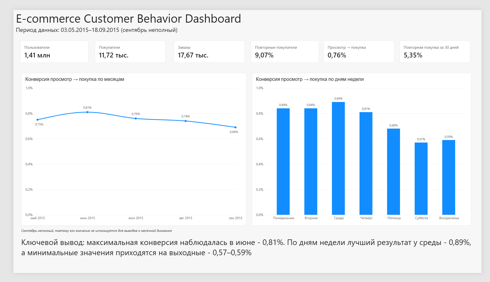
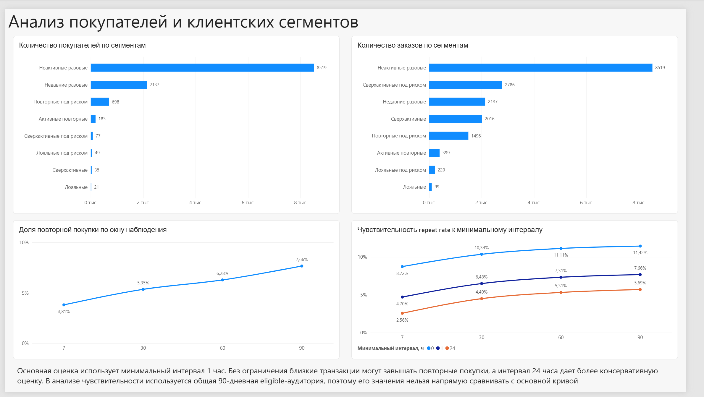
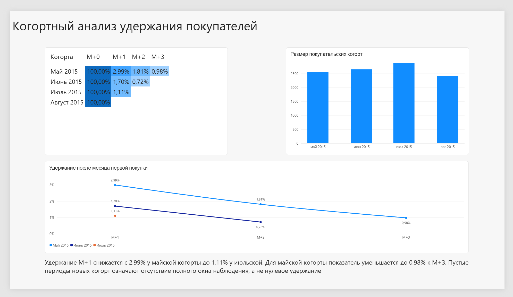
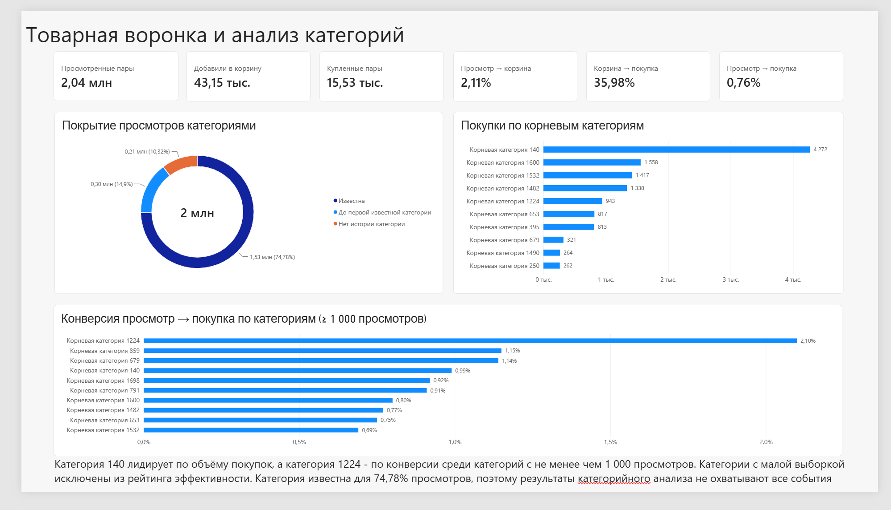

# E-commerce Customer Behavior & Funnel Analysis

Портфолио-проект по анализу поведения покупателей интернет-магазина на основе
Retailrocket recommender system dataset. Проект охватывает полный цикл работы с
данными: очистку и исследование в Python, построение аналитического слоя в
PostgreSQL и создание интерактивного отчета в Power BI



## Цели проекта

- построить воронку `просмотр → корзина → покупка`
- исследовать конверсию по месяцам, дням недели и товарным категориям
- сегментировать покупателей по активности и давности покупки
- оценить долю повторных покупок при разных окнах наблюдения
- провести когортный анализ удержания
- подготовить аналитические представления для Power BI

## Данные

В анализе используются события интернет-магазина за период с 3 мая по
18 сентября 2015 года:

- 2 755 641 событие
- 1 407 580 пользователей
- 11 719 покупателей
- 17 672 заказа
- история изменения категорий товаров и дерево из 1 669 категорий

Исходные и промежуточные CSV-файлы не включены в репозиторий из-за размера.
Сентябрь представлен не полностью, поэтому его значение не используется для
выводов о помесячной динамике

## Основные результаты

- Общая конверсия из просмотра в покупку - **0,76%**
- Конверсия из просмотра в корзину - **2,11%**, из корзины в покупку -
  **35,98%**
- Доля покупателей с несколькими заказами - **9,07%**
- Скорректированная доля повторной покупки в течение 30 дней - **5,35%**
- Максимальная месячная конверсия наблюдалась в июне - **0,81%**
- Лучший результат по дням недели показала среда - **0,89%**; минимальные
  значения пришлись на выходные - **0,57–0,59%**
- Крупнейший клиентский сегмент - неактивные разовые покупатели:
  **8 519 человек**
- Категория `140` лидирует по объему покупок - **4 272**, а категория `1224`
  по конверсии среди категорий с не менее чем 1 000 просмотров - **2,10%**
- Для майской когорты удержание снижается с **2,99%** в `M+1` до **0,98%** в
  `M+3`

## Power BI Dashboard

Отчет состоит из четырех страниц

### 1. Обзор

Ключевые показатели бизнеса, динамика конверсии по месяцам и сравнение дней
недели


### 2. Покупатели

Распределение покупателей и заказов по сегментам, доля повторных покупок и
анализ чувствительности к окну наблюдения и минимальному интервалу между
транзакциями



### 3. Когортное удержание

Матрица удержания, размеры когорт и изменение показателя после месяца первой
покупки. Пустые ячейки новых когорт означают отсутствие полного окна
наблюдения, а не нулевое удержание



### 4. Воронка и категории

Общая товарная воронка, покрытие просмотров категориями, лидеры по числу
покупок и рейтинг конверсии с отсечением категорий с малой выборкой



## Архитектура

```text
Retailrocket CSV
      ↓
Python / Jupyter - очистка и исследование
      ↓
PostgreSQL raw - исходные таблицы
      ↓
PostgreSQL analytics - заказы, воронки, сегменты, когорты
      ↓
Power BI - модель и четыре страницы отчета
```

## Структура репозитория

```text
notebooks/    исследовательский анализ и подготовка данных
scripts/      экспорт CSV и загрузка данных в PostgreSQL
sql/          последовательный SQL-пайплайн и BI-представления
powerbi/      файл Power BI Desktop
docs/images/  скриншоты страниц отчета
```

SQL-пайплайн включает создание схем и таблиц, проверки качества, индексы,
формирование заказов, пользовательских метрик, сегментов, товарной воронки,
когорт и итоговых представлений для Power BI

## Технологии

- Python, Pandas, NumPy, SciPy
- Jupyter Notebook, Matplotlib, Seaborn
- PostgreSQL, Psycopg
- Power BI, Power Query, DAX
- Git и GitHub
